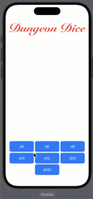

# DungeonDice

DungeonDice is a SwiftUI application that allows users to roll various types of dice, commonly used in tabletop role-playing games. This app provides a user-friendly interface to roll different dice and displays the result.

## Features

- **Roll Different Dice**: Select and roll different dice types such as d4, d6, d8, d10, d12, d20, and d100.
- **Dynamic Button Layout**: Adaptive layout for dice buttons to ensure consistent spacing and alignment across different device orientations.

## Screenshots



## Requirements

- iOS 15.0+
- Xcode 13.0+
- SwiftUI

## Installation

1. Clone the repository:
```bash
git clone https://github.com/dobson980/DungeonDice.git
```

2. Open the project in Xcode:
```swift
cd DungeonDice
open DungeonDice.xcodeproj
```

## Usage

### Dice Rolling
The ContentView provides the main interface for rolling dice. Users can select any of the dice buttons to roll the corresponding dice, and the result is displayed at the top of the screen.

### Customizable Dice Buttons
The DiceButtonView allows customization of dice buttons, including size, padding, background color, and corner radius.

## Code Overview

### DungeonDiceApp
DungeonDiceApp is the entry point of the app.
```swift
import SwiftUI

@main
struct DungeonDiceApp: App {
    var body: some Scene {
        WindowGroup {
            ContentView()
        }
    }
}
```

### ContentView
ContentView sets up the main interface with a grid of dice buttons and displays the result of the dice roll.
```swift
import SwiftUI

struct ContentView: View {
    let dice = Dice.allCases
    let columns: [GridItem] = Array(repeating: .init(.flexible(), spacing: 0), count: 3)
    let buttonWidth: CGFloat = 115
    let buttonHeight: CGFloat = 50
    let buttonPadding: CGFloat = 2
    let buttonBGColor: Color = .blue
    let buttonCornerRadius: CGFloat = 8
    
    @State private var resultMessage = ""

    var body: some View {
        VStack {
            DungeonDiceTitleView()
            
            Text(resultMessage)
                .font(.largeTitle)
                .fontWeight(.medium)
                .multilineTextAlignment(.center)
                .frame(height: 150)
            
            Spacer()
            
            VStack(spacing: 0) {
                LazyVGrid(columns: columns, spacing: 1) {
                    ForEach(dice.dropLast(dice.count % 3), id: \.self) { dice in
                        DiceButtonView(
                            dice: dice,
                            resultMessage: $resultMessage,
                            buttonWidth: buttonWidth,
                            buttonHeight: buttonHeight,
                            padding: buttonPadding,
                            backgroundColor: buttonBGColor,
                            cornerRadius: buttonCornerRadius
                        )
                    }
                }
                
                HStack {
                    Spacer()
                    ForEach(dice.suffix(dice.count % 3), id: \.self) { dice in
                        DiceButtonView(
                            dice: dice,
                            resultMessage: $resultMessage,
                            buttonWidth: buttonWidth,
                            buttonHeight: buttonHeight,
                            padding: buttonPadding,
                            backgroundColor: buttonBGColor,
                            cornerRadius: buttonCornerRadius
                        )
                    }
                    Spacer()
                }
                .padding(.horizontal)
            }
        }
        .padding()
    }
}

#Preview {
    ContentView()
}
```

### DiceButtonView
DiceButtonView represents a customizable dice button.
```swift
import SwiftUI

struct DiceButtonView: View {
    let dice: Dice
    @Binding var resultMessage: String
    var buttonWidth: CGFloat
    var buttonHeight: CGFloat
    var padding: CGFloat
    var backgroundColor: Color
    var cornerRadius: CGFloat
    
    var body: some View {
        Button {
            resultMessage = "You rolled a \(dice.roll()) on a \(dice)"
        } label: {
            Text("\(dice)")
                .frame(width: buttonWidth, height: buttonHeight)
                .foregroundColor(.white)
                .background(backgroundColor)
                .cornerRadius(cornerRadius)
        }
        .padding(padding)
    }
}

#Preview {
    @Previewable var dice: Dice = .d4
    @Previewable @State var resultMessage: String = ""
    
    let initialMessage = "You rolled a \(dice.roll()) on a \(dice)"
    
    resultMessage = initialMessage
    
    return DiceButtonView(
        dice: dice,
        resultMessage: $resultMessage,
        buttonWidth: 100,
        buttonHeight: 50,
        padding: 10,
        backgroundColor: .blue,
        cornerRadius: 10
    )
}
```

### DungeonDiceTitleView
DungeonDiceTitleView displays the title of the app.
```swift
import SwiftUI

struct DungeonDiceTitleView: View {
    var body: some View {
        Text("Dungeon Dice")
            .font(Font.custom("Snell Roundhand", size: 60))
            .fontWeight(.black)
            .foregroundColor(.red)
            .minimumScaleFactor(0.5)
            .lineLimit(1)
    }
}

#Preview {
    DungeonDiceTitleView()
}
```

### Dice
Dice enum represents different types of dice that can be rolled.

```swift
import Foundation

enum Dice: Int, CaseIterable {
    case d4 = 4
    case d6 = 6
    case d8 = 8
    case d10 = 10
    case d12 = 12
    case d20 = 20
    case d100 = 100
    
    func roll() -> Int {
        return Int.random(in: 1...self.rawValue)
    }
}
```

## License
This project is licensed under the MIT License. See the [LICENSE](LICENSE) file for details.
